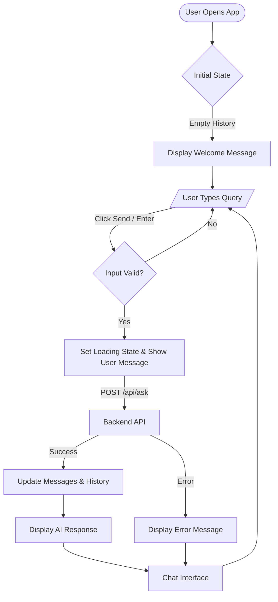
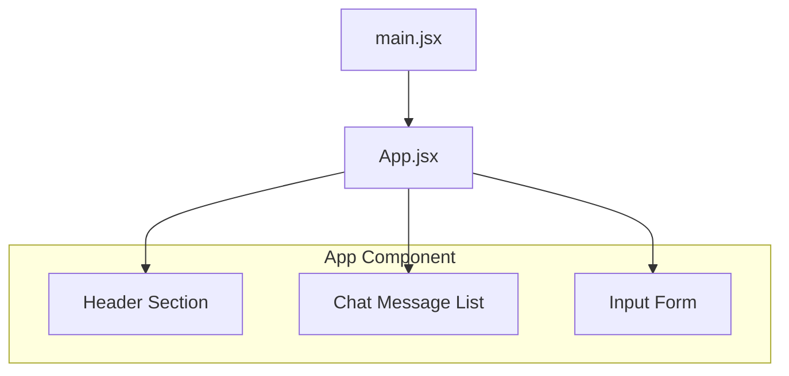

# Application Architecture & Interaction Flow

This document details the interaction flow within the AskDocAI application.

## 📄 Application Flow Diagram

Since AskDocAI is a Single Page Application (SPA), all interactions happen within the main Chat Interface. The diagram below illustrates the user journey and state transitions.

## 🧩 Component Hierarchy

The frontend is built as a lightweight React application with the following component structure:

