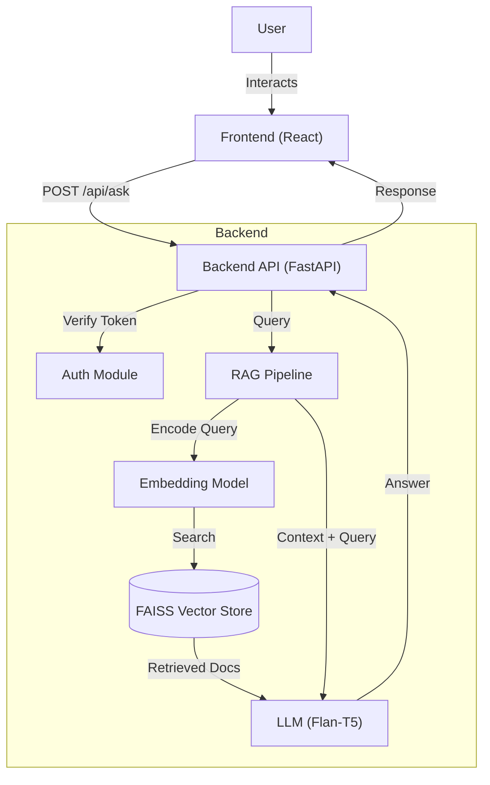

# AskDocAI

AskDocAI is an intelligent Question-Answering system designed to answer queries based on medical documents. It leverages a Retrieval-Augmented Generation (RAG) pipeline to provide accurate, context-aware responses by retrieving relevant information from a vector database before generating an answer.

## 📂 Project Structure

```
AskDocAI/
├── backend/                # FastAPI backend server
│   ├── main.py             # Entry point for the API
│   ├── auth/               # Authentication logic
│   └── rag_pipeline/       # RAG logic (LangChain, FAISS, LLM)
├── Frontend/               # React frontend application
│   ├── src/                # Source code (Components, App logic)
│   ├── package.json        # Frontend dependencies
│   └── vite.config.js      # Vite configuration
├── scripts/                # Utility scripts
│   └── create_faiss_index.py # Script to generate vector embeddings
├── vector_store_pubmed/    # FAISS vector store (generated)
├── requirements.txt        # Python dependencies
└── README.md              # Project documentation
```

## 🚀 Unique Functionality

- **RAG Architecture**: Combines vector search (retrieval) with a generative model (generation) to hallucinate less and ground answers in fact.
- **Medical Domain Focus**: Designed to work with PubMed or medical texts stored in a FAISS index.
- **Conversational Context**: Capable of handling follow-up questions by maintaining chat history.
- **Secure API**: Implements basic token-based authentication for API access.

## 🛠️ Tech Stack

### Frontend
- **Framework**: [React](https://react.dev/) (via [Vite](https://vitejs.dev/))
- **Styling**: [Tailwind CSS](https://tailwindcss.com/)
- **Icons**: [Lucide React](https://lucide.dev/)
- **HTTP Client**: [Axios](https://axios-http.com/)

### Backend
- **Framework**: [FastAPI](https://fastapi.tiangolo.com/)
- **AI Orchestration**: [LangChain](https://www.langchain.com/)
- **Vector Store**: [FAISS](https://github.com/facebookresearch/faiss)
- **Embeddings**: Sentence Transformers (`all-MiniLM-L6-v2`)
- **LLM**: Hugging Face Pipeline (`google/flan-t5-large`)

## 🏗️ Architecture



## ⚡ Installation & Running

### Prerequisites
- Python 3.8+
- Node.js & npm

### 1. Backend Setup

 Navigate to the project root:
   ```bash
   cd AskDocAI
   ```

 Create a virtual environment and install dependencies:
   ```bash
   python -m venv .venv
   source .venv/bin/activate  # On Windows: .venv\Scripts\activate
   pip install -r requirements.txt
   ```

*(Note: Ensure you have `torch` installed compatible with your hardware).*

 Initialize the Vector Store (if not already present):
   ```bash
   python scripts/create_faiss_index.py
   ```

 Start the Backend Server:
   ```bash
   uvicorn backend.main:app --reload
   ```
   The API will run at `http://127.0.0.1:8000`.

### 2. Frontend Setup

 Open a new terminal and navigate to the `Frontend` folder:
   ```bash
   cd Frontend
   ```

 Install dependencies:
   ```bash
   npm install
   ```

 Start the development server:
   ```bash
   npm run dev
   ```
   The app will typically run at `http://localhost:5173`.

## 🧪 Usage

1. Open the frontend URL in your browser.
2. Enter a medical question (e.g., "What are the symptoms of diabetes?").
3. The system will retrieve relevant snippets from the indexed documents and generate an answer.
