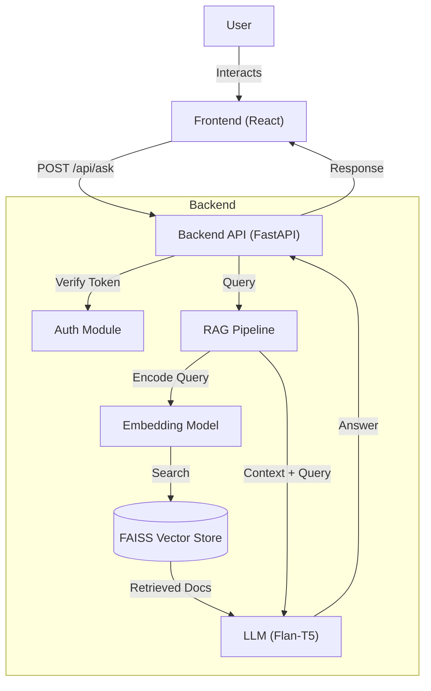

# AskDocAI

AskDocAI is an intelligent Question-Answering system designed to answer queries based on medical documents. It leverages a Retrieval-Augmented Generation (RAG) pipeline to provide accurate, context-aware responses by retrieving relevant information from a vector database before generating an answer.

## 📂 Project Structure

```
AskDocAI/
├── backend/                # FastAPI backend server
│   ├── main.py             # Entry point for the API
│   ├── auth/               # Authentication logic
│   └── rag_pipeline/       # RAG logic (LangChain, FAISS, LLM)
├── Frontend/               # React frontend application
│   ├── src/                # Source code (Components, App logic)
│   ├── package.json        # Frontend dependencies
│   └── vite.config.js      # Vite configuration
├── scripts/                # Utility scripts
│   ├── create_faiss_index.py # Script to generate vector embeddings
│   └── import_medquad.py     # Script to import MedQuAD dataset
├── vector_store_pubmed/    # FAISS vector store (generated)
├── requirements.txt        # Python dependencies
└── README.md              # Project documentation
```

## 🚀 Unique Functionality

- **RAG Architecture**: Combines vector search (retrieval) with a generative model (generation) to hallucinate less and ground answers in fact.
- **Source Citations**: Returns metadata (source, question ID) for the retrieved documents used to generate the answer.
- **Medical Domain Focus**: Designed to work with MedQuAD, PubMed, or medical texts stored in a FAISS index.
- **Conversational Context**: Capable of handling follow-up questions by maintaining chat history.
- **Secure API**: Implements basic token-based authentication for API access.

## 🛠️ Tech Stack

### Frontend
- **Framework**: [React](https://react.dev/) (via [Vite](https://vitejs.dev/))
- **Styling**: [Tailwind CSS](https://tailwindcss.com/)
- **Icons**: [Lucide React](https://lucide.dev/)
- **HTTP Client**: [Axios](https://axios-http.com/)

### Backend
- **Framework**: [FastAPI](https://fastapi.tiangolo.com/)
- **AI Orchestration**: [LangChain](https://www.langchain.com/)
- **Vector Store**: [FAISS](https://github.com/facebookresearch/faiss)
- **Embeddings**: Sentence Transformers (`all-MiniLM-L6-v2`)
- **LLM**: Hugging Face Pipeline (`google/flan-t5-large`)

## 🏗️ Architecture


```mermaid
graph TD
    User[User] -->|Interacts| UI["Frontend (React)"]
    UI -->|POST /api/ask| API["Backend API (FastAPI)"]
    
    subgraph Backend
        API -->|Verify Token| Auth[Auth Module]
        API -->|Query| RAG[RAG Pipeline]
        
        RAG -->|Encode Query| Embed[Embedding Model]
        Embed -->|Search| VectorDB[(FAISS Vector Store)]
        VectorDB -->|Retrieved Docs| LLM["LLM (Flan-T5)"]
        RAG -->|Context + Query| LLM
    end
    
    LLM -->|Answer| API
    API -->|Response| UI
```

## ⚡ Installation & Running

### Prerequisites
- Python 3.8+
- Node.js & npm

### 1. Backend Setup

 Navigate to the project root:
   ```bash
   cd AskDocAI
   ```

 Create a virtual environment and install dependencies:
   ```bash
   python -m venv .venv
   source .venv/bin/activate  # On Windows: .venv\Scripts\activate
   pip install -r requirements.txt
   ```

*(Note: Ensure you have `torch` installed compatible with your hardware).*

 Initialize the Vector Store (if not already present):
   ```bash
   python scripts/create_faiss_index.py
   ```

 Start the Backend Server:
   ```bash
   uvicorn backend.main:app --reload
   ```
   The API will run at `http://127.0.0.1:8000`.

### 2. Frontend Setup

 Open a new terminal and navigate to the `Frontend` folder:
   ```bash
   cd Frontend
   ```

 Install dependencies:
   ```bash
   npm install
   ```

 Start the development server:
   ```bash
   npm run dev
   ```
   The app will typically run at `http://localhost:5173`.

## 🧪 Usage

1. Open the frontend URL in your browser.
2. Enter a medical question (e.g., "What are the symptoms of diabetes?").
3. The system will retrieve relevant snippets from the indexed documents and generate an answer.

## 📥 Import MedQuAD Dataset

1. Download and extract MedQuAD XML files to a local folder (example: `./MedQuAD-master`).
2. Convert XML to this project's JSON format:
   ```bash
   python scripts/import_medquad.py --input ./MedQuAD-master --output data/medical_data.json
   ```
3. Rebuild the FAISS vector index with metadata:
   ```bash
   python scripts/create_faiss_index.py
   ```

## 🌐 Import Larger Online PubMed Dataset

Use NCBI E-utilities to fetch larger abstract datasets directly from PubMed.
If `--query` is omitted, the importer uses a built-in broad medical-issues query.

1. Download records by query:
  ```bash
  python scripts/import_pubmed.py \
    --email "you@example.com" \
    --max-records 10000 \
    --start-year 2015 \
    --output data/medical_data.json
  ```

2. Optionally merge new PubMed results into existing JSON:
  ```bash
  python scripts/import_pubmed.py \
    --query "cardiovascular disease" \
    --email "you@example.com" \
    --max-records 3000 \
    --append \
    --output data/medical_data.json
  ```

3. Rebuild the FAISS index:
  ```bash
  python scripts/create_faiss_index.py
  ```

The backend `/api/ask` endpoint now includes:
- `response`: generated answer (existing field, unchanged for frontend compatibility)
- `citations`: source metadata for retrieved context documents
